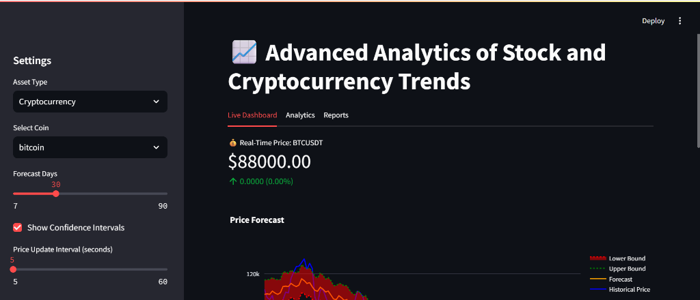
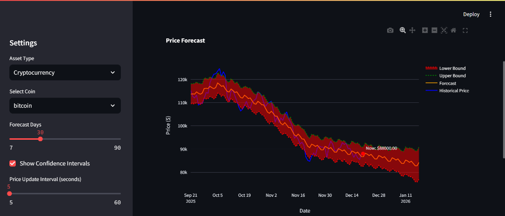
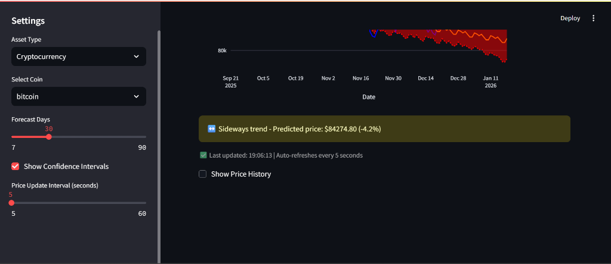
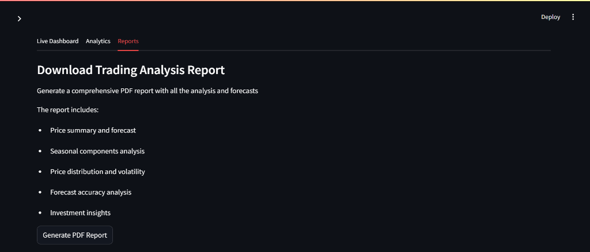

# Crypto Trend Analysis Dashboard

A real-time cryptocurrency and stock trading analytics dashboard built with Streamlit, featuring advanced forecasting using Facebook Prophet, live price tracking, and comprehensive PDF reporting.


## Table of Contents
- [Features](#features)
- [Screenshots](#screenshots)
- [Installation](#installation)
- [Usage](#usage)
- [Project Structure](#project-structure)
- [Configuration](#configuration)
- [Technologies Used](#technologies-used)
- [Author](#author)
- [License](#license)

## Features

### Real-Time Trading Dashboard
- Live price tracking with real-time cryptocurrency prices from Binance API
- Stock market data integration via Yahoo Finance
- Configurable auto-refresh intervals (5-60 seconds)
- Price history tracking and visualization
- Interactive Plotly charts with dark theme

### Advanced Forecasting
- Time series forecasting using Facebook Prophet ML model
- Predictions for 7-90 days ahead
- Confidence intervals with upper and lower bound predictions
- Seasonal analysis and decomposition
- Forecast accuracy metrics and validation

### Analytics Suite
- Seasonal component visualization
- Historical price distribution analysis
- 7-day rolling volatility calculations
- Actual vs predicted price comparisons
- Statistical error distribution analysis

### Professional Reports
- Comprehensive PDF report generation
- Multi-chart reports with all visualizations
- Automated bullish/bearish trend detection
- One-click downloadable PDF exports

## Screenshots

### Live Dashboard


### Price Forecast


### Investment Insights


### Analytics


### Reports


## Installation

### Prerequisites
- Python 3.8 or higher
- pip package manager

### Setup Instructions

1. Clone the repository
```bash
git clone https://github.com/yourusername/crypto-trend-analysis.git
cd crypto-trend-analysis
```

2. Install dependencies
```bash
pip install -r requirements.txt
```

3. Run the application
```bash
streamlit run app.py
```

4. Open your browser and navigate to `http://localhost:8501`

## Usage

### Cryptocurrency Analysis
1. Select "Cryptocurrency" from the sidebar
2. Choose a coin: Bitcoin, Ethereum, Solana, Ripple, or Dogecoin
3. Adjust forecast days (7-90 days)
4. View real-time prices and predictions on the Live Dashboard tab

### Stock Analysis
1. Select "Stock" from the sidebar
2. Enter a stock symbol (e.g., AAPL, TSLA, GOOGL)
3. Choose duration: 3 months, 6 months, or 1 year
4. Configure forecast settings and view analytics

### Generate Reports
1. Navigate to the Reports tab
2. Click "Generate PDF Report"
3. Download comprehensive analysis with all charts and insights

### Explore Analytics
1. Visit the Analytics tab for:
   - Seasonal component breakdowns
   - Price distribution histograms
   - Forecast accuracy metrics
   - Volatility trends

## Project Structure

```
crypto-trend-analysis/
│
├── app.py                          # Main Streamlit application
├── data_collection.py              # Historical data fetching script
├── trend_analysis.py               # Standalone trend prediction script
├── requirements.txt                # Python dependencies
├── README.md                       # Project documentation
├── screenshots/                    # Application screenshots
│
├── BTC-USD_historical_data.csv     # Sample historical data
├── BTC-USD_forecast.csv            # Sample forecast data
└── temp_*.png                      # Temporary chart images
```

## Configuration

Customize the dashboard via sidebar controls:
- **Asset Type**: Cryptocurrency or Stock
- **Forecast Days**: 7 to 90 days
- **Confidence Intervals**: Toggle on/off
- **Update Interval**: 5 to 60 seconds

## Technologies Used

### Core Dependencies
- **Streamlit** - Web application framework
- **Pandas** - Data manipulation and analysis
- **yfinance** - Yahoo Finance data retrieval
- **Prophet** - Time series forecasting
- **Plotly** - Interactive visualizations
- **Matplotlib** - Static plotting
- **NumPy** - Numerical computing
- **ReportLab** - PDF generation
- **Kaleido** - Static image export for Plotly
- **Requests** - HTTP library for API calls

### Supported Assets

**Cryptocurrencies** (via Binance API):
- Bitcoin (BTC)
- Ethereum (ETH)
- Solana (SOL)
- Ripple (XRP)
- Dogecoin (DOGE)

**Stocks** (via Yahoo Finance):
- Any valid stock ticker symbol
- Historical data: 3mo, 6mo, 1y

## Standalone Scripts

### Data Collection
Fetch historical cryptocurrency data:
```bash
python data_collection.py
```
Modify the script to change symbol, start date, and end date.

### Trend Analysis
Run standalone trend prediction:
```bash
python trend_analysis.py
```
Analyzes CSV data and generates forecast plots.

## Author

**G S SHYAM SUNDER**

- Email: shyamsundhar0103@gmail.com
- GitHub: [Your GitHub Profile](https://github.com/yourusername)

## Contributing

Contributions are welcome! Please feel free to submit a Pull Request.

## License

This project is open source and available under the [MIT License](LICENSE).

## Acknowledgments

- Facebook Prophet for the forecasting model
- Streamlit for the web framework
- Binance API for real-time crypto data
- Yahoo Finance for stock market data

---

**If you find this project useful, please consider giving it a star on GitHub!**
